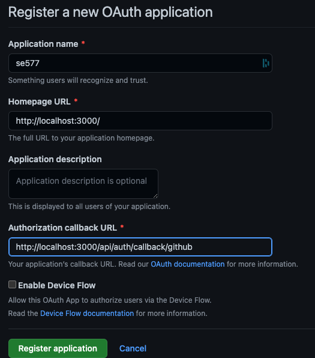

# Quick start

## Description

A simple web app build with NextJS (Using Node.js 12.22.0 or later).
A "FrontEnd" for the GitHub API showing the users repositories and comparing
the current user with the GitHub user `derjust`.

GitHub is also used as OAuth authentication server.

### New Functionality

#### Timeline view

A new "historical view" for repositories was added since the `proj-Release-4`.

Opening the repositories overview `/repos` and clicking on a given repoository doesn't link to GtiHub directly anymore but opens a timeline of commits
to the default branch of that repository. From this historical view there are mulitple ways to jump into the GitHub website itself.

#### OpenAPI

All API endpoints are self-documenting via the OpenAPI spec under `/api/docs`

A SwaggerUI is available at `/api-doc` (ie. [http://localhost:3000/api-doc](http://localhost:3000/api-doc))

### Existing Functionality

#### (Un)authorized button
The two buttons exist on the 'about me and you' page at `/about`.
A login is required for the `Authenticated` button (it is rendered in **red** if the user is not logged in & the call will fail if still executed)


This is just to show the distinction between the GitHub integration on the frontend calling its API directly.

#### GitHub integration

The Gists at `/gists` page shows the user's Gists - and requries the user to be logged in.
The Repos page at `/repos` shows the repositories of the user [`derjust`](https://github.com/derjust) - a login by the user is not required

This is just to show the distinction between the GitHub integration on the Backend.

## Build

### Preparation

Create a [GitHub OAuth App](https://docs.github.com/en/developers/apps/building-oauth-apps/creating-an-oauth-app) with the following settings.


**Note:** If the web app is hosted somwhere else, you must update the callback URL accordingly:

* http://localhost:3000/api/auth/callback/github and _also_ set
* NEXTAUTH_URL=https://example.com in `.env.local`!

A `.env.local` file must be created and the properties from the created GitHub OAuth app must be set in it.
You can use `env.local.example` as a template. This can also be accomplished by running `make init` once.

## Makefile

1. To build a Docker image of this application run `make build`
2. To run it use `make run`

Also `make all` exists to execute `build` & `run` together.

## Manual

Instead of the `Makefile`, all commands can be steps manually, too 

### Build it

To build a Docker image of this application run

```
docker build -t se577 .
```

### Run it

Run it via

```
docker run -p 3000:3000 se577
```

and open `http://localhost:3000/` in your browser.

## Architecture

Please find detailed architecture description in th [ProjectStructure.md](./ProjectStructure.md)