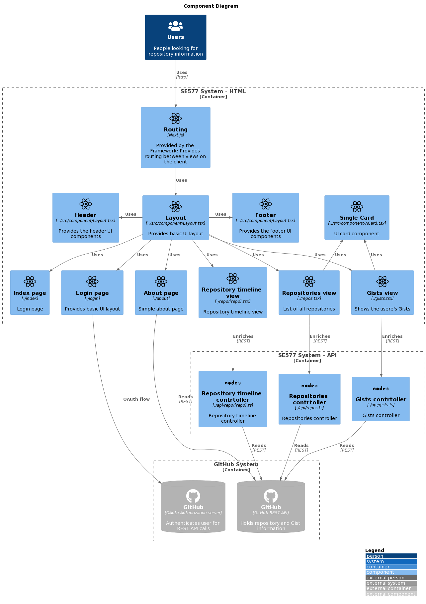

# Architecture

## Overview

To get an overview, please see the following C4 models:

### C4-Context

The overall context of the SE577 application is depicted below:
It shows a current state in which the SE477 system is integrated with a YAML file as data store.

At this time, the focus is on the SE577 itself. No external system has been integrated.

### C4-Container

The SE577 system can be understood as a client-server application using a Single-Page-Application (SPA) deployment:

The SPA is realized with [Next.js](https://nextjs.org/), a React-based Framework supporting features beyond SPA including compile time rendering (including [SSR and SSG](https://nextjs.org/docs/basic-features/data-fetching/overview)) with seamless detection (via the absence of `getServerSideProps()` and `getInitialProps()` in a page) for static elements, allowing the usage of CDNs and other caching capabilities with no additional effort.

For decoration purposes, [MaterialUI v4](https://v4.mui.com/) is used.

### C4-Component

The components of the SPA and its backing NodeJS server can found in the following concrete architecture:

Each page is pre-rendered during the build process.
If a page has no runtime dynamic content (index, about, login) then the pure HTML page is kept
and delivered to the Browser on request. This is ideal for adding a CDN in front of the
(Docker) API container.

Pages that feature (repos, gists) runtime dynamic are pre-rendered without the dynamic part.
This allows the Browser to retrieve the basic HTML and cache it (or a CDN) and only
the dynamic part is loaded on each request.

This approach significantly improves the load time of the application and allows for future
growth by using standard internet technologies like CDNs.

One drawback (which is inherent to all SPA) is that SEO / crawlers still don't retrieve
the dynamic content as these usually do not execute JavaScript. NextJS though provides
facilities to provide so-called ['fallback data' allowing the initial HTML to contain some
static content](https://nextjs.org/docs/basic-features/data-fetching/get-server-side-props#fetching-data-on-the-client-side) - which is replaced in the Browser with the refreshed data.

## Quality attributes

Beyond the functionality, the following non-functional requirements shaped the decisions for this application.

### Usability

The application is a web application.
This means its main output format is HTML and consumed & interpreted by a browser. While this allows
for a high useability due to HTML's textual format, modern web applications use a lot of JavaScript 
to perform. Most JavaScript frameworks - like the used React - are even fundamental and far away from the
early days of the Internet in which JavaScript was only used to _augment_ the HTML. In React webapps the 
JavaScript is fundamental to display any content.

This though creates multiple issues all impacting the usability (among other things):

* Content becomes available 'later' than it has to be as not only the HTML and JavaScript has to be transmitted but also interpreted by the Browser
* Some users chose to not use JavaScript in their browsers redering most web framework enabeld websites hard to use
* Some agents (like search engine crawlers or softare for visual impaired people) rely on the semantic HTML
and have limited or no JavaScript functionality - again hindering the usage of JavaScript we applications.

The used NextJS framework though operates in two modes:

* During development, all pages are created and rendered like any other React application. The drawback are stated above but the benefit - for developers and the agility of the development process - are also present: Quick turnaround and immediate visibilty of changes.
* For a produciton build though, NextJS will generate as much as static HTML as possilbe from the React components (and shrink the JavaScript to only what's needed). This allows the vast majority of the HTML to be present on the first request from an agent - and only updated data is additionally added.
This greatly improves how the web app can be consumed without a 'full' JavaScript-enabled environment.
** This also improves SEO scores as the HTML itself becomes semanticly complete and can be crawled by search engines

Additionally, Standard Material UI is used which is common on Android smartphones to allow for a recognizable style & color language.

### Performance / Scalability

NextJS usage of Pre-render, static pages greatly improves the performance and scalability of the application:

Basic HTTP caching becomes available as proper HTML resources (and all scripts are compress/`webpack`-ed so only what's needed is added) are now served to the client that can be treated as those.
This allows even to further improve the performance for clients by leveraging not only the Docker-based
Node server but a full CDN: All static content can be served from the CDN and only changed content will be retrieved from the REST endpoints.

One possilbe extension for NextJS is [terraform-aws-next-js](https://github.com/milliHQ/terraform-aws-next-js) which leverages AWS's cloud functionality - while not needing any change to the code of the webapp itself - which allows developers to still use their local setup to work on the application:

### Interoperability

All API endpoints are implemtend following the REST principles and provide JSON payloads.

The endpoitns are self-documented via the OpenAPI standard which allows clients to self-discover the endpoints, generate code as they deem nessassary while providing a simple diagnositcs UI (SwagerUI) to try and test the endpoints alongside the documentation.

### Reliability / Availability

The software is provided in a Docker image. This allows for easy depoloyment on infrastructure provding the desired relaiblity and availablity. (ie. Kubernetes cluster, AWS ECS etc.)

NextJS is ready for CDN (static content distribution) with serverless deployments of the REST endpoints itself following the same progrmaming model. 

### Security

Security is enabled by 'the lack of it': The OAuth webflow is used.
It is up to the OAuth provider to do all the authentication and account management and this web app just uses the established session and the provided access token.
No secret data or tokens are stored on the server side and standard JWT tokens (with signinng) are used to store the session on the client side.

### Maintainability / Testability / Reusability

NextJS is based on React which favors a component model.
Views are assembled based on standard and custom components in this application.

This would allow for easy JavaScript unit testing (which hasn't been implemented as the time of this writing)
Also, React's state management is used. If the application grows into a more complex system, the usual providers like Redux can be integrated to keep the logic testable.

### Supportability

Only basic observability exist at this point.
Basic logging is provided though it offers a lot of room for growth: Loggingg in the code should be improved as also some reasonable log storage system being implemented.

Health checks should be added to confirm the system is working as intended.

A basic triage UI via SwaggerUI is avaialble to test the REST endpoints.
