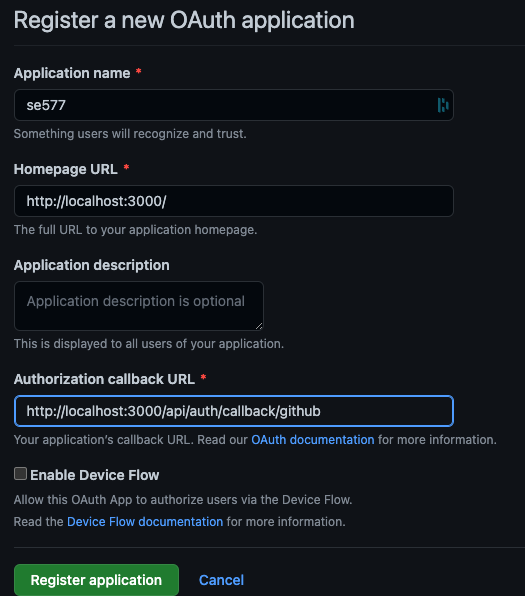
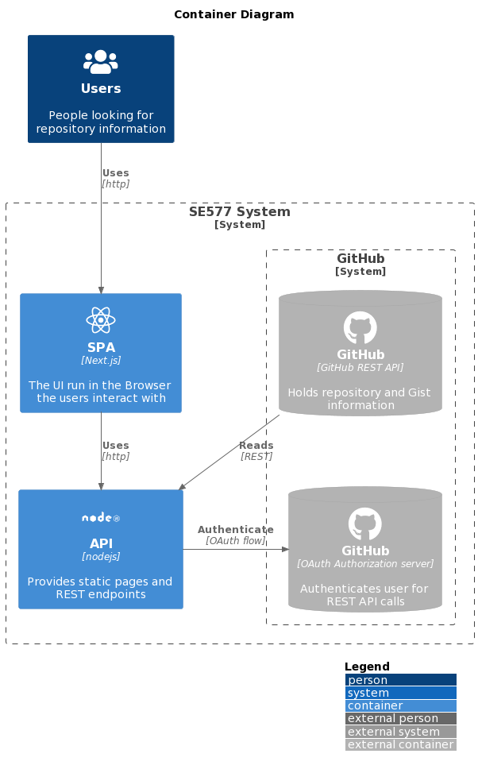

# Quick start

## Description

A simple web app build with NextJS (Using Node.js 12.22.0 or later).
A "FrontEnd" for the GitHub API showing the users repositories and comparing
the current user with the GitHub user `derjust`.

GitHub is also used as OAuth authentication server.

### (Un)authorized button
The two buttons exist on the 'about me and you' page at `/about`.
A login is required for the `Authenticated` button (it is rendered in **red** if the user is not logged in & the call will fail if still executed)


This is just to show the distinction between the GitHub integration on the frontend calling its API directly.

### GitHub integration

The Gists at `/gists` page shows the user's Gists - and requries the user to be logged in.
The Repos page at `/repos` shows the repositories of the user [`derjust`](https://github.com/derjust) - a login by the user is not required

This is just to show the distinction between the GitHub integration on the Backend.

## Build

### Preparation

Create a [GitHub OAuth App](https://docs.github.com/en/developers/apps/building-oauth-apps/creating-an-oauth-app) with the following settings.


**Note:** If the web app is hosted somwhere else, you must update the callback URL accordingly:
* http://localhost:3000/api/auth/callback/github and _also_ set
* NEXTAUTH_URL=https://example.com in `.env.local`!

A `.env.local` file must be created and the properties from the created GitHub OAuth app must be set in it.
You can use `env.local.example` as a template. This can also be accomplished by running `make init` once.

## Makefile
To build a Docker image of this application run `make build`
To run it use `make run`

`make all` exists to execute `build` & `run` together.

## Manual
### Build it

To build a Docker image of this application run

```
docker build -t se577 .
```

### Run it

Run it via

```
docker run -p 3000:3000 se577
```

and open `http://localhost:3000/` in your browser.


# Architecture

## OAuth reflection

OAuth at this point is the go-to solution for authentication and service authorization in a distributed web:
It definies clear roles and responsibilities for the participants in the flow.
It especially allows for a services A used by user to give permissions to service B on behalf of the user - but the user
stays in control: At any point in time, the access to service A from service B can be revoked by the user.
This and the concept of scopes allows for fine grained control without the need for a user to share his/her passwords form one service to another.

On top, token rotation exists for extended securities. All in all this makes OAuth not impacted by the usual leaks (and in general weak passwords) that are used by humans.

While the flow is reasonably simple to follow, it remains a somewhat complex technology as it uses the full stack of the web (HTTP for transport, TLS for transport encryption, cookies/JSON/Base64 for storage) resulting in a lot of moving parts during an authentication flow.
Though as soon as the authentication is done (once), the usage afterwards boils down to handling a classic authentication token (via the `Authorization` header).

Thanks to being an RFC standard, there have emerged a lot of tooling support and libraries to enable OAuth for all frameworks and languages making it's usage straight forward.

It is worth pointing out that OAuth only addresses the communication and trust between the three parties (user, service A, service B). It is 'out of scope' on how to deal with the actual access token from OAuths perspective.


For this web app I used JWT tokens as it eases the usage: No backend data storage is needed: The session is persisted in the JWT cookie and (signed) sent to the client.
On every request, the cookie (and thus the session) is passed back to the backend and can be used (after verification of the signature).

The drawback is a slight performance impact as the session storage effectdively is the cookie itself resulting in more data being transmitted between the browser and the backend on every request.

## C4-Context

The overall context of the SE577 application is depicted below:
It shows a current state in which the SE477 system is integrated with a YAML file as data store.


At this time, the focus is on the SE577 itself. No external system has been integrated.

## C4-Container

The SE577 system can be understood as a client-server application using a Single-Page-Application (SPA) deployment:



The SPA is realized with [Next.js](https://nextjs.org/), a React-based Framework supporting features beyond SPA including compile time rendering (including [SSR and SSG](https://nextjs.org/docs/basic-features/data-fetching/overview)) with seamless detection (via the absence of `getServerSideProps()` and `getInitialProps()` in a page) for static elements, allowing the usage of CDNs and other caching capabilities with no additional effort.

For decoration purposes, [MaterialUI v4](https://v4.mui.com/) is used.

## C4-Component

The components of the SPA and its backing NodeJS server can found in the following concrete architecture:


Each page is pre-rendered during the build process.
If a page has no runtime dynamic content (index, about, login) then the pure HTML page is kept
and delivered to the Browser on request. This is ideal for adding a CDN in front of the
(Docker) API container.

Pages that feature (repos, gists) runtime dynamic are pre-rendered without the dynamic part.
This allows the Browser to retrieve the basic HTML and cache it (or a CDN) and only
the dynamic part is loaded on each request.

This approach significantly improves the load time of the application and allows for future
growth by using standard internet technologies like CDNs.

One drawback (which is inherent to all SPA) is that SEO / crawlers still don't retrieve
the dynamic content as these usually do not execute JavaScript. NextJS though provides
facilities to provide so-called ['fallback data' allowing the initial HTML to contain some
static content](https://nextjs.org/docs/basic-features/data-fetching/get-server-side-props#fetching-data-on-the-client-side) - which is replaced in the Browser with the refreshed data.
